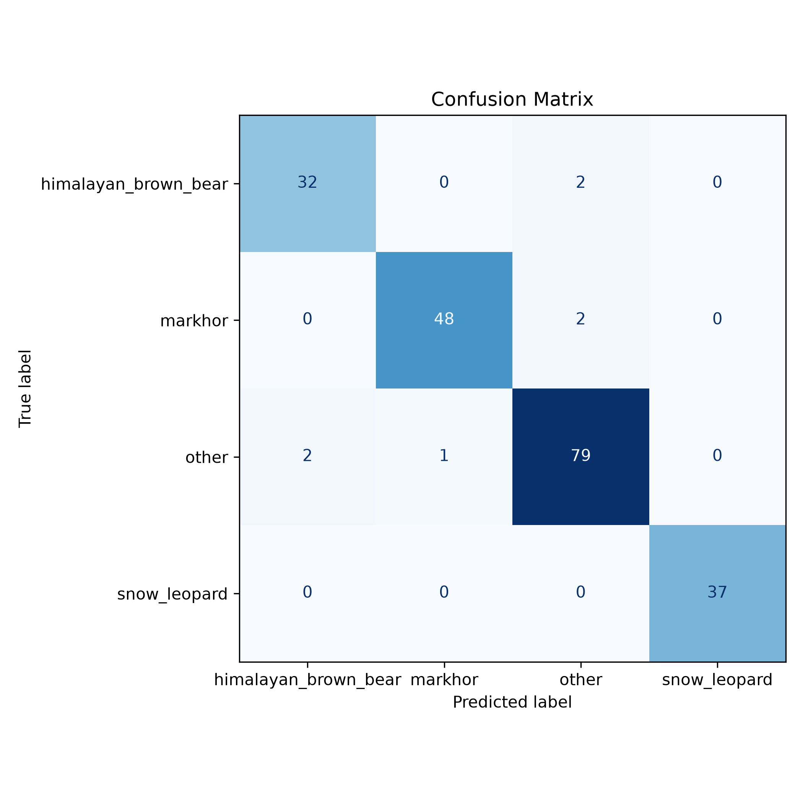

# Himalayan Wildlife Classifier

A computer vision project built with PyTorch and Streamlit to classify images of three endangered Himalayan species: the Snow Leopard, Markhor and Himalayan Brown Bear. The model uses transfer learning with ResNet18 and includes an internal **other** class together with confidence thresholding to reduce false positives on unsupported species.

## Dataset Attribution

This project utilizes the **Wildlife Animals (Snowleopard, Brownbear, Markhor)** dataset.

* **Dataset Source:** [Wildlife Animals (Snowleopard, Brownbear, Markhor)](https://www.kaggle.com/datasets/hunzaikashif49/wildlife-animals-snowleopard-brwonbear-markhor)
* **Description:** A curated collection of wildlife images representing three highly endangered, high-altitude species native to the Gilgit-Baltistan region.

To improve robustness, a manually curated **other** class containing visually similar animals such as domestic cats, leopards, polar bears, wolves and goats was added during training.

## Architecture & Approach

* **Framework:** PyTorch
* **Model Architecture:** ResNet18 (Transfer Learning)
* **Training Strategy:** Feature Extraction with a pretrained ResNet18 backbone and a custom 4-class classification head.
* **Training Classes:** Himalayan Brown Bear, Markhor, Snow Leopard and Other (internal rejection class).
* **Data Augmentation:** RandomResizedCrop and RandomHorizontalFlip.
* **UI/Frontend:** Streamlit for local interactive inference.

## Performance

The model achieved **96.55% Validation Accuracy**.

| Class | Precision | Recall | F1-score |
| :--- | ---: | ---: | ---: |
| Himalayan Brown Bear | 0.9412 | 0.9412 | 0.9412 |
| Markhor | 0.9796 | 0.9600 | 0.9697 |
| Other | 0.9518 | 0.9634 | 0.9576 |
| Snow Leopard | 1.0000 | 1.0000 | 1.0000 |

### Confusion Matrix



## QA Testing, Edge Cases & Limitations

The model was tested on external images in addition to the validation dataset.

* An internal **other** class and an **80% confidence threshold** help reduce false positives on unsupported species.
* Visually similar animals can still be confused in some cases, for example domestic cats and snow leopards, polar bears and Himalayan brown bears or domestic goats and markhors.
* Predictions assigned to the internal **other** class or below the confidence threshold are displayed as **Not a Supported Species**.

**Future Improvements:** Fine tune the ResNet backbone, expand the **other** class with additional species, collect more diverse wildlife images and explore object detection models such as YOLO.

## Local Setup & Usage

### 1. Install Dependencies

```bash
pip install -r requirements.txt
```

### 2. Run the Web Interface

```bash
streamlit run app.py
```

Upload any image through the browser UI to receive a prediction and confidence score.